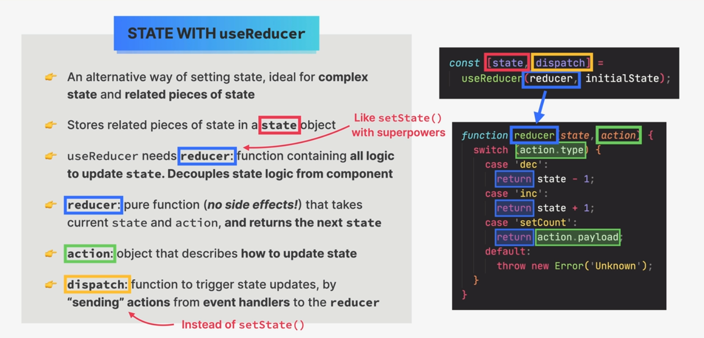

# useReducer hook


## Managing state with useReducer



## How useReducer update state


## useReducer mental model


## useReducer vs useState


## When to use useReducer


## useReducer live action

```js
import { useReducer, useState } from "react";
const initialState = { count: 0, step: 1 };

function reducer(state, action) {
  switch (action.type) {
    case "inc":
      return { ...state, count: state.count + state.step };
    case "dec":
      return { ...state, count: state.count - state.step };
    case "setCount":
      return { ...state, count: action.payload };
    case "setStep":
      return { ...state, step: action.payload };
    case "reset":
      return initialState;
    default:
      throw new Error("unknown action type");
  }
}

function DateCounter() {
  // const [step, setStep] = useState(1);
  // const [count, setCount] = useState(0);

  const [state, dispatch] = useReducer(reducer, initialState);
  const { count, step } = state;

  // This mutates the date object.
  const date = new Date("june 21 2027");
  date.setDate(date.getDate() + count);

  const dec = function () {
    // setCount((count) => count - 1);
    // setCount((count) => count - step);

    dispatch({ type: "dec" });
  };

  const inc = function () {
    // setCount((count) => count + 1);
    // setCount((count) => count + step);

    dispatch({ type: "inc" });
  };

  const defineCount = function (e) {
    // setCount(Number(e.target.value));

    dispatch({ type: "setCount", payload: Number(e.target.value) });
  };

  const defineStep = function (e) {
    dispatch({ type: "setStep", payload: Number(e.target.value) });
  };

  const reset = function () {
    // setCount(0);
    // setStep(1);

    dispatch({ type: "reset" });
  };

  return (
    <div className="counter">
      <div>
        <input
          type="range"
          min="0"
          max="10"
          value={step}
          onChange={defineStep}
        />
        <span>{step}</span>
      </div>

      <div>
        <button onClick={dec}>-</button>
        <input value={count} onChange={defineCount} />
        <button onClick={inc}>+</button>
      </div>

      <p>{date.toDateString()}</p>

      <div>
        <button onClick={reset}>Reset</button>
      </div>
    </div>
  );
}
export default DateCounter;
```
